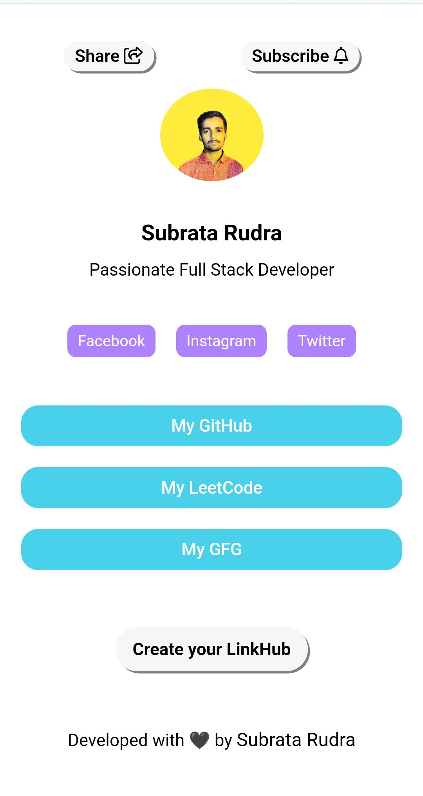

# LinkHub - A Full Stack LinkTree Clone

This is a full stack LinkTree clone using MERN stack.


## Architectural Components:

- **Frontend**: React JS
- **Backend**: Node JS, Redis
- **Subscriber Mail Sender Service**: Node JS
- **Database**: mongoDB

## Overview

LinkHub is a web application which provides you a webpage to share multiple links to your audiences.

## LinkHub Page Sample



## LinkHub Dashboard Page


## LinkHub Insights Page


## LinkHub Account Page


## Features

1. **Authentication**:

   - Sign Up
   - Log In
   - Email Verification

2. **Dashboard**:

   - LinkHub profile picture edit
   - LinkHub title edit
   - LinkHub description edit
   - New link add
   - Existing link edit
   - Existing link delete

3. **Insights**:
   - See total visits count to your linkhub
   - See total subscribers count to your linkhub

4. **Account**
   - See account details such as account creation date, email, username
   - Log out
   - Delete account

5. **Reset Password**
   - Reset password when user forgets password
  
6. **Share LinkHub**
   - Direct share through multiple platforms like Reddit, Facebook, Linkedin, X(formerly Twitter), Whatsapp and Email

7. **Subscribe LinkHub**
   - Subscribe to anyone's linkhub so that when the owner of the linkhub adds links the subscribers get updates through email

## Technologies Used

- **Frontend**: React JS, Chakra UI, HTML, CSS
- **Backend**: Node JS, Express JS, Redis, JWT, Nodemailer, ejs, HTML, CSS
- **Subscriber Mail Sender Service**: Node JS, ejs, Nodemailer, ejs, HTML, CSS
- **Database**: mongoDB

## Hosting Solution
- **Frontend**: Vercel.com
- **Backend**: Render.com
- **Redis**: Render.com
- **Subscriber Mail Sender Service**: Render.com
- **Database**: MongoDB Cloud

## Setup Requirements
- Node JS
- Redis
- MongoDB or MongoDB Cloud

## Setup Guidelines
1. Fork this repository
2. Clone this repository
3. Ensure that you are in the root directory of the project
4. Go to backend directory by running ➡️
   
   ```dotenv
   cd '.\LinkHub Backend\'
   ```
5. Now install dependencies by running ➡️
   
   ```dotenv
   npm install
   ```
6. Now return to root directory by running ➡️
   
   ```dotenv
   cd ../
   ```
7. Go to frontend directory by running ➡️
    
    ```dotenv
    cd '.\LinkHub Frontend\'
    ```
8. Now install dependencies by running ➡️

    ```dotenv
    npm install
    ```
9. Now return to root directory by running ➡️

    ```dotenv
    cd ../
    ```
10. Go to subscriber mail sender directory by running ➡️

    ```dotenv
    cd '.\LinkHub Mail Sender\'
    ```
11. Now install dependencies by running ➡️

    ```dotenv
    npm install
    ```
12. Now return to root directory by running ➡️

    ```dotenv
    cd ../
    ```
13. Now **generate app password to access email sending**. Take help from this [Helpful Video](https://youtu.be/XeWswDLDPS4?si=ENOLjyxTZM73bWrV)
14. Now create file in the root of 'LinkHub Backend' folder and name it '.env'
15. Now open that '.env' file in code editor and then write this:
     ```dotenv
    MONGO_URI = <Your Mongodb Url>
    JWT_SECRET = <Your JWT Secret>
    EMAIL = <Your Email>
    PASSWORD = <Your Email's App Password>
    JWT_DATA_MAKER = <Your JWT Data Maker(actually any number of your choice)>
    REDIS_PORT = 6379
    ```
16. Now create file in the root of 'LinkHub Mail Sender' folder and name it '.env'
17. Now open that '.env' file in code editor and then write this:
     ```dotenv
    MONGO_URI = <Your Mongodb Url>
    EMAIL = <Your Email>
    PASSWORD = <Your Email's App Password>
    ```
18. Now start Redis server by running this command ➡️
    ```dotenv
    sudo service redis-server start
    ```
19. Now open the 2 directories(LinkHub Backend and LinkHub Mail Sender) in 2 different terminals by using the cd commands(as instructed previously) and run this command in both the terminals ➡️
    ```dotenv
    npm run dev
    ```
20. Now open the LinkHub Frontend directory in another terminal by using the cd commands and run this command ➡️
    ```dotenv
    npm start
    ```
21. Now open http://localhost:3000 and you are ready to use.

## LIVE Hosted Project Is Here 👇
https://linkhub-by-subrata.vercel.app/

## To Watch Demonstration Video 👇Click Below

[](https://drive.google.com/file/d/16A8JUxJJ9IYu2Gydwtgi71tRi1cAF_FM/view?usp=sharing)
